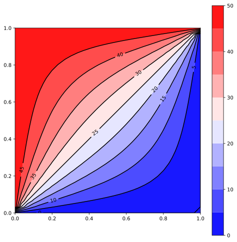
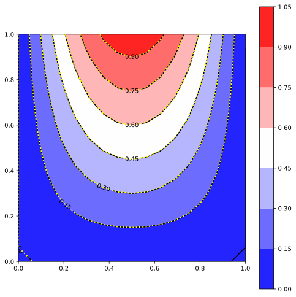

# Solve many linear systems with russell and MPI

This code shows how to solve many linear systems using MPI and [russell](https://github.com/cpmech/russell/)

> [!NOTE]
> This code requires `RUSSELL_SPARSE_USE_LOCAL_MUMPS=1` environment variable. Thus, you must compile MUMPS locally (it's easy!) as explained in [russell](https://github.com/cpmech/russell/). The problem is that Debian's libmumps-seq is linked with OpenMPI (it shouldn't!). This linkage clashes with the MPI code used here.

## 2D Poisson equation in parallel

We can solve multiple linear systems using the code snippet:

```rust
// initialize the MPI engine
mpi_init_thread(MpiThread::Serialized)?;

// allocate MPI communicator and determine this processor's rank
let mut comm = Communicator::new()?;
let rank = comm.rank()?;

// create coefficient matrix
let (fdm, mut mat) = create_discrete_laplacian(opt.nx, opt.nx, one_based);

// allocate linear solver
let mut solver = LinSolver::new(genie)?;

// perform the factorization
solver.actual.factorize(&mut mat, None)?;

// allocate the solution vector
let mut x = Vector::new(dim);

// solve many times with increasing multipliers
const MULTIPLIERS: &[f64] = &[1.0, 2.0, 5.0, 10.0, 100.0];
for multiplier in MULTIPLIERS {
    let b = populate_rhs_vector(&fdm, *multiplier);
    solver.actual.solve(&mut x, &mat, &b, false)?;

    // use MPI here to communicate the results among the processors
}
```

See [mpi_poisson.rs](https://github.com/cpmech/solve_many_linsys/blob/main/src/bin/mpi_poisson.rs)

Execute the code by calling:

```bash
mpiexec --np 2 target/mpi_poisson -- 1000 mumps
```

Or:

```bash
/run-mpi-poisson.bash 2 1000 mumps
```

where 2 is the number of MPI processes, 1000 is the grid division along one direction, and umfpack is the linear solver.

This problem is [perfectly parallel](https://en.wikipedia.org/wiki/Embarrassingly_parallel) thus the total elapsed time should not depend on the number of (real) machine cores. However, the shared use of resources (e.g., memory) may cause some performance losses. Some results are shown below (size is the number of processes; the number of threads within each process is fixed to 1).

**Mumps** (see [log-mumps.txt](https://github.com/cpmech/solve_many_linsys/blob/main/log-mumps.txt))

```text
size = 1, nx = 1000, dim = 1000000, genie = Mumps
elapsed time ~ 5.149872364s

size = 4, nx = 1000, dim = 1000000, genie = Mumps
elapsed time ~ 5.635183616s

size = 8, nx = 1000, dim = 1000000, genie = Mumps
elapsed time ~ 6.014376048s

size = 24, nx = 1000, dim = 1000000, genie = Mumps
elapsed time ~ 11.618588898s
```

**Umfpack:** (see [log-umfpack.txt](https://github.com/cpmech/solve_many_linsys/blob/main/log-umfpack.txt))

```text
size = 1, nx = 1000, dim = 1000000, genie = Umfpack
elapsed time ~ 6.474512896s

size = 4, nx = 1000, dim = 1000000, genie = Umfpack
elapsed time ~ 8.152130192s

size = 8, nx = 1000, dim = 1000000, genie = Umfpack
elapsed time ~ 11.103594675s

size = 24, nx = 1000, dim = 1000000, genie = Umfpack
elapsed time ~ 29.423033658s
```

It is worth noting that UMFPACK requires more memory usage and allocations than MUMPS. Thus, this may explain its non-optimal performance.

Note: The results are collected on a 13th Gen Intel(R) Core(TM) i9-13900K with 24 cores (8 performance cores and 16 efficient cores).

## non-MPI examples and tests

### Laplace equation in 2D

Approximate (with the Finite Differences Method, FDM) the solution of

```text
∂²ϕ     ∂²ϕ
———  +  ——— = 0
∂x²     ∂y²
```

on a (1.0 × 1.0) rectangle with the following essential (Dirichlet) boundary conditions:

* left:    `ϕ(0.0, y) = 50.0`
* right:   `ϕ(1.0, y) = 0.0`
* bottom:  `ϕ(x, 0.0) = 0.0`
* top:     `ϕ(x, 1.0) = 50.0`

See [ex_non_mpi_laplace.rs](https://github.com/cpmech/solve_many_linsys/blob/main/examples/ex_non_mpi_laplace.rs)



### Poisson equation in 2D 

Approximate (with the Finite Differences Method, FDM) the solution of

```text
∂²ϕ   ∂²ϕ
——— + ——— = - π² y sin(π x)
∂x²   ∂y²
```

on a (1.0 × 1.0) square with the following essential boundary conditions:

* left:    `ϕ(0.0, y) = 0.0`
* right:   `ϕ(1.0, y) = 0.0`
* bottom:  `ϕ(x, 0.0) = 0.0`
* top:     `ϕ(x, 1.0) = sin(π x)`

The analytical solution is:

```text
ϕ(x, y) = y sin(π x)
```

**Reference:**

* Olver PJ (2020) - page 210 - Introduction to Partial Differential Equations, Springer

See [test_poisson_1.rs](https://github.com/cpmech/solve_many_linsys/blob/main/tests/test_poisson_1.rs)


