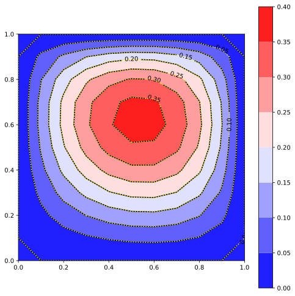

# Solve many linear systems with russell and MPI

This code shows how to solve many linear systems using MPI and [russell](https://github.com/cpmech/russell/)

> [!NOTE]
> This code requires `RUSSELL_SPARSE_USE_LOCAL_MUMPS=1` environment variable. Thus, you must compile MUMPS locally (it's easy!) as explained in [russell](https://github.com/cpmech/russell/). The problem is that Debian's libmumps-seq is linked with OpenMPI (it shouldn't!). This linkage clashes with the MPI code used here.

## Solve the heat equation in parallel

We can solve multiple linear systems using the code snippet:

```rust
// initialize the MPI engine
mpi_init_thread(MpiThread::Serialized)?;

// allocate MPI communicator and determine this processor's rank
let mut comm = Communicator::new()?;
let rank = comm.rank()?;

// create coefficient matrix
let (fdm, mut mat) = create_discrete_laplacian(opt.nx, opt.nx, one_based);

// allocate linear solver
let mut solver = LinSolver::new(genie)?;

// perform the factorization
solver.actual.factorize(&mut mat, None)?;

// allocate the solution vector
let mut x = Vector::new(dim);

// solve many times with increasing multipliers
const MULTIPLIERS: &[f64] = &[1.0, 2.0, 5.0, 10.0, 100.0];
for multiplier in MULTIPLIERS {
    // perform the solution
    let b = populate_rhs_vector(&fdm, *multiplier);
    solver.actual.solve(&mut x, &mat, &b, false)?;

    // synchronize
    comm.barrier()?;
}
```

Execute the code by calling:

```bash
mpiexec --np 2 target/mpi_heat_equation -- 1000 umfpack
```

Or:

```bash
/run-mpi-heat-equation.bash 2 1000 umfpack
```

where 2 is the number of MPI processes, 1000 is the grid division along one direction, and umfpack is the linear solver.

## non-MPI examples

## Poisson's equation in 2D

Approximate (with the Finite Differences Method, FDM) the solution of

```text
∂²ϕ     ∂²ϕ
———  +  ——— = 0
∂x²     ∂y²
```

on a (1.0 × 1.0) rectangle with the following essential (Dirichlet) boundary conditions:

* left:    `ϕ(0.0, y) = 50.0`
* right:   `ϕ(1.0, y) = 0.0`
* bottom:  `ϕ(x, 0.0) = 0.0`
* top:     `ϕ(x, 1.0) = 50.0`

The Rust code is shown below (from [ex_non_mpi_heat_equation.rs](https://github.com/cpmech/solve_many_linsys/blob/main/examples/ex_non_mpi_heat_equation.rs))

```rust
// allocate the Laplacian operator
let (nx, ny) = (31, 31);
let mut fdm = DiscreteLaplacian2d::new(1.0, 1.0, 0.0, 1.0, 0.0, 1.0, nx, ny).unwrap();

// set essential boundary conditions
fdm.set_essential_boundary_condition(Side::Left, 50.0);
fdm.set_essential_boundary_condition(Side::Right, 0.0);
fdm.set_essential_boundary_condition(Side::Bottom, 0.0);
fdm.set_essential_boundary_condition(Side::Top, 50.0);

// compute the augmented coefficient matrix and the correction matrix
let (aa, cc) = fdm.coefficient_matrix(false).unwrap();

// allocate the left- and right-hand side vectors
let dim = fdm.dim();
let mut phi = Vector::new(dim);
let mut rhs = Vector::new(dim);

// set the 'prescribed' part of the left-hand side vector with the essential values
fdm.loop_over_prescribed_values(|i, value| {
    phi[i] = value; // xp := xp
});

// initialize the right-hand side vector with the correction
cc.mat_vec_mul(&mut rhs, -1.0, &phi)?; // bu := -Aup⋅xp

// if there were natural (Neumann) boundary conditions,
// we could set `bu := natural()` here

// set the 'prescribed' part of the right-hand side vector with the essential values
fdm.loop_over_prescribed_values(|i, value| {
    rhs[i] = value; // bp := xp
});

// solve the linear system
let mut mat = SparseMatrix::from_coo(aa);
let mut solver = LinSolver::new(Genie::Umfpack)?;
solver.actual.factorize(&mut mat, None)?;
solver.actual.solve(&mut phi, &mut mat, &rhs, false)?;
```

The figure below show the results (see [ex_non_mpi_heat_equation.rs](https://github.com/cpmech/solve_many_linsys/blob/main/examples/ex_non_mpi_heat_equation.rs))


## non-MPI tests


### 2D heat equation with source term

Approximate (with the Finite Differences Method, FDM) the solution of

```text
∂²ϕ     ∂²ϕ
———  +  ——— =  source(x, y)
∂x²     ∂y²
```

on a (1.0 × 1.0) square with homogeneous essential boundary conditions. The source term is given by (for a manufactured solution):

```text
source(x, y) = 14y³ - (16 - 12x) y² - (-42x² + 54x - 2) y + 4x³ - 16x² + 12x
```

The analytical solution is:

```text
ϕ(x, y) = x (1 - x) y (1 - y) (1 + 2x + 7y)
```

The Rust code is shown below (from [test_heat_equation_source.rs](https://github.com/cpmech/solve_many_linsys/blob/main/tests/test_heat_equation_source.rs))

```rust
// allocate the Laplacian operator
let (nx, ny) = (11, 11);
let mut fdm = DiscreteLaplacian2d::new(1.0, 1.0, 0.0, 1.0, 0.0, 1.0, nx, ny).unwrap();

// set zero essential boundary conditions
fdm.set_homogeneous_boundary_conditions();

// compute the augmented coefficient matrix
let (aa, _) = fdm.coefficient_matrix(false).unwrap();

// allocate the left- and right-hand side vectors
let dim = fdm.dim();
let mut phi = Vector::new(dim);
let mut rhs = Vector::new(dim);

// set the 'prescribed' part of the left-hand side vector with the essential values
// (this step is not needed with homogeneous boundary conditions)

// initialize the right-hand side vector with the correction
// (this step is not needed with homogeneous boundary conditions)

// set the right-hand side vector with the source term
fdm.loop_over_grid_points(|i, x, y| {
    let (xx, yy) = (x * x, y * y);
    let (xxx, yyy) = (xx * x, yy * y);
    let source =
        14.0 * yyy - (16.0 - 12.0 * x) * yy - (-42.0 * xx + 54.0 * x - 2.0) * y + 4.0 * xxx - 16.0 * xx + 12.0 * x;
    rhs[i] = source;
});

// set the 'prescribed' part of the right-hand side vector with the essential values
fdm.loop_over_prescribed_values(|i, value| {
    rhs[i] = value; // bp := xp
});

// solve the linear system
let mut mat = SparseMatrix::from_coo(aa);
let mut solver = LinSolver::new(Genie::Umfpack)?;
solver.actual.factorize(&mut mat, None)?;
solver.actual.solve(&mut phi, &mut mat, &rhs, false)?;
```

The figure below show the results (see [test_heat_equation_source.rs](https://github.com/cpmech/solve_many_linsys/blob/main/tests/test_heat_equation_source.rs))


